简单选课系统

1.主界面

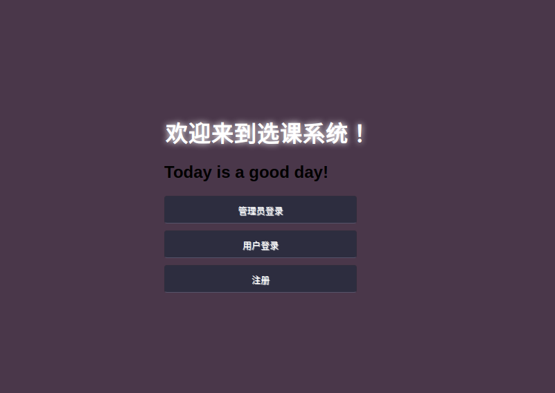

主界面分成3个部分

1.管理员登录

要求只能用pxc和123456登录系统。

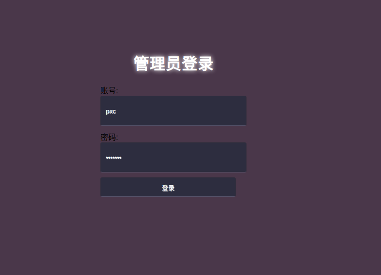

2.用户注册

新用户注册，需输入用户名（名字缩写），密码，性别，年龄。

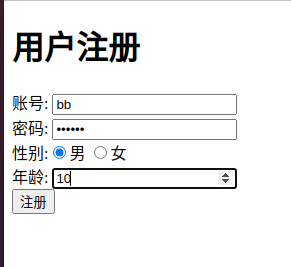

用户名要求纯英文小写，密码账号不得为空，若没问题则直接跳转到用户登录界面。

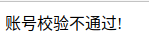

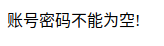

3.用户登录界面

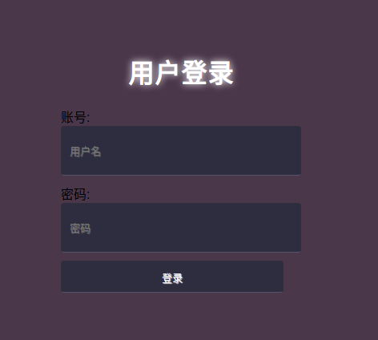

用户名密码不能为空，若密码错误会提示：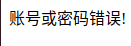

4.学生选课界面

用户成功登录后跳转到选课界面，学生输入自己的账号，选择课程，就能进行选课。

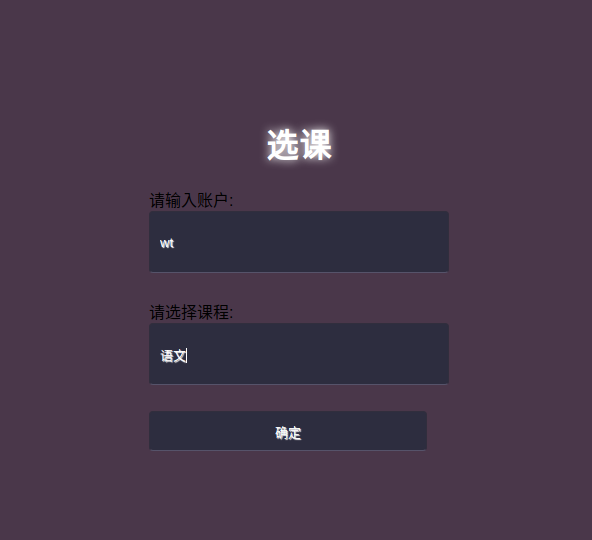

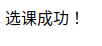

5.管理员界面

管理员可以通过学生名字（即账户名）进行查询或者删除。

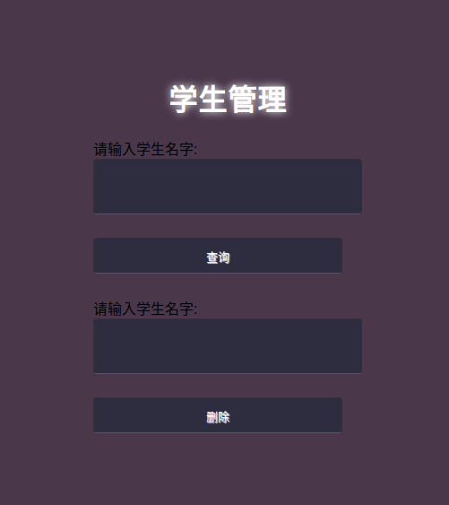

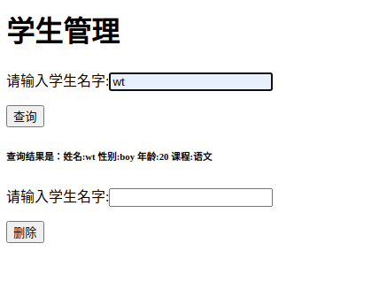

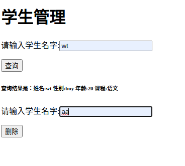

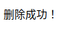

